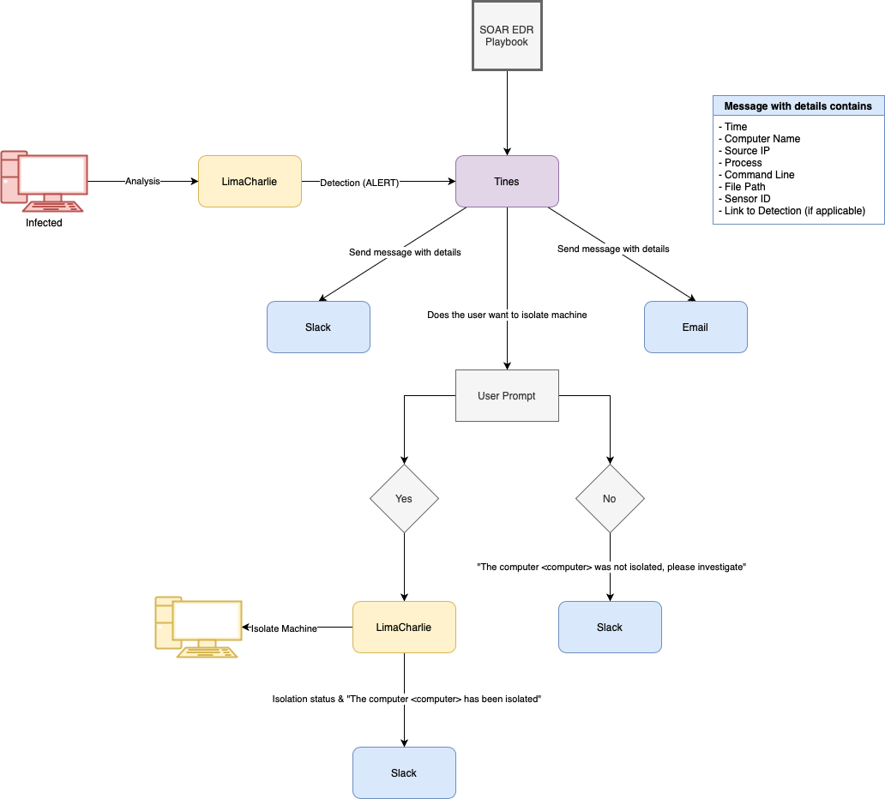

# SOAREDR Playbook

## Overview
This repository contains the SOAREDR (Security Orchestration, Automation, and Response for Endpoint Detection and Response) playbook. The playbook is designed to guide users through the process of handling security incidents, specifically focusing on isolating potentially compromised systems and communicating with users.

## Logical Diagram

The logical flow of the SOAREDR playbook is as follows:

1. **Message with Details Contains**: The process starts when a message containing specific details is received.
2. **LineCharlie**: The message is associated with LineCharlie, which is likely a reference to a specific communication channel or protocol.
3. **Dateation (All-Edit)**: The date and time of the incident are recorded for documentation purposes.
4. **Lines**: The message is parsed to extract relevant lines of information.
5. **Save Message with Details**: The message, along with its details, is saved for future reference.
6. **Send Message with Details**: The message is forwarded to the appropriate team or system for further action.
7. **Back**: If the user does not want to proceed, the process can be reversed or stopped.
8. **Does the User Want to Receive Machine**: The user is prompted to decide if they want to receive a machine (possibly a virtual machine or a secure environment).
   - **Yes**: If the user agrees, the process continues.
   - **No**: If the user declines, the process may be halted or redirected.
9. **If the Computer-Computer-Vres Not Isolated, Please Investigate**: If the system in question is not isolated, further investigation is required.
10. **Location Learning**: The system learns the location of the incident for better context.
11. **LineCharlie**: The incident is again associated with LineCharlie for tracking.
12. **Slack**: Communication via Slack is initiated to coordinate the response.
13. **Position Status:4**: The status of the incident is updated to position 4, indicating a specific stage in the response process.
14. **If No Computer-Computers Has Been Isolated**: If no systems have been isolated, the process may loop back to earlier steps or trigger additional actions.

## Usage

To use this playbook, follow the logical diagram and steps outlined above. Ensure that all messages are properly documented and that communication channels like Slack are utilized effectively for coordination.

## Contributing

Contributions to this playbook are welcome. Please fork the repository and submit a pull request with your changes.

## License

This project is licensed under the MIT License - see the LICENSE file for details.

## Contact

For any questions or further information, please contact the repository maintainer.

---

This README provides a high-level overview of the SOAREDR playbook and its logical flow. For more detailed instructions, refer to the specific steps and documentation within the repository.
