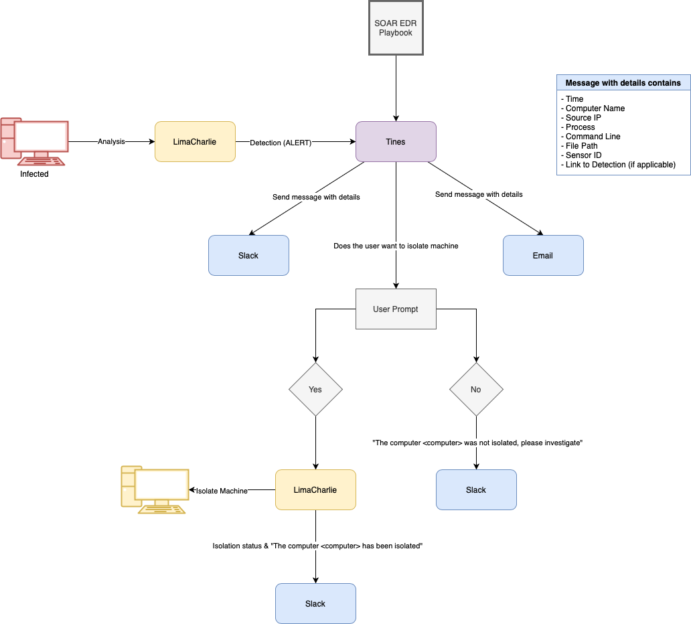

# SOAREDR Playbook

## Overview
This repository contains the SOAREDR (Security Orchestration, Automation, and Response for Endpoint Detection and Response) playbook. The playbook is designed to guide users through the process of handling security incidents, specifically focusing on isolating potentially compromised systems and communicating with users.

---

## Logical Diagram

  

### Logical Flow  
1. **Event Logs**: The process begins when LimaCharlie’s detection and response functions are triggered by specific event logs.  
2. **LimaCharlie Integration to SOAR**: The alert is integrated into the Tines (SOAR) platform to initiate a playbook.  
3. **Internal Communication**: The alert is automatically broadcast to communication platforms (Slack, Email).  
4. **User Prompt**: The SOC Analyst investigates the alert. A user prompt provides Boolean values to determine if endpoint isolation is needed.  
   - **Yes**: The computer is isolated, and an update is sent to communication platforms.  
   - **No**: The computer remains on the network, and an update is sent to communication platforms.  
5. **Message with Details**: A text box displays filtered information through playbook functions.  

---

## Cloud OS Provisioning  
For this lab, a **Windows 2022 server** is implemented in the **Vultr cloud environment** to simulate an infected machine. Firewall configurations ensure that access to this VM is restricted to the host IP address via **Remote Desktop Protocol (RDP) port 3389**.  

The purpose of accessing this device is to simulate a malicious actor gaining unauthorized access to run malicious scripts. In this project, the **Lazagne** script kiddie penetration testing tool (obtained from GitHub) is used to test EDR capabilities.  

---

## Device Enrollment (LimaCharlie)  
Device enrollment is critical for monitoring and protecting endpoints. Two methods are recommended based on network size:  

### Manual Enrollment (Recommended for Small Networks)  
For small networks, manual enrollment is straightforward. This is done through the LimaCharlie platform:  
1. Use the **Installation Documentation** on the enrollment key page.  
2. Utilize the provided enrollment key to install the LimaCharlie agent on the endpoint device.  

### Automated Enrollment via Group Policy Objects (GPO) in Active Directory  
For larger networks, automate enrollment using **Group Policy Objects (GPO)** in Active Directory. This method allows simultaneous enrollment of multiple devices.  

---

## Configuration  
Once devices are enrolled, configure the following settings:  
- **Sensors and Detections**: Configure sensors to collect relevant data and set up detections for potential security incidents.  
- **Response Actions**: Define automated response actions for LimaCharlie to take when specific detections are triggered.  

For this lab, a **Windows 2022 server** was manually configured as the only endpoint.  

---

## Tines Integration  
Tines is integrated to automate workflows and responses. This involves:  
- Developing workflows in Tines to automate responses to security incidents.  
- Configuring triggers to initiate automated actions based on specific criteria.  

### Developing a Playbook  
The playbook development process includes:  
1. **Incident Identification**: Define how incidents are identified and categorized.  
2. **Response Actions**: Outline steps to be taken in response to different types of incidents.  
3. **Communication Protocols**: Establish protocols for internal and external communication during an incident.

---

## Conclusion  
The **SOAR-EDR playbook** is a comprehensive guide designed to enhance the efficiency and effectiveness of security incident response. By following the outlined steps and integrations, organizations can ensure a coordinated and automated approach to managing security incidents, minimizing potential damage, and improving overall security posture.  

---
